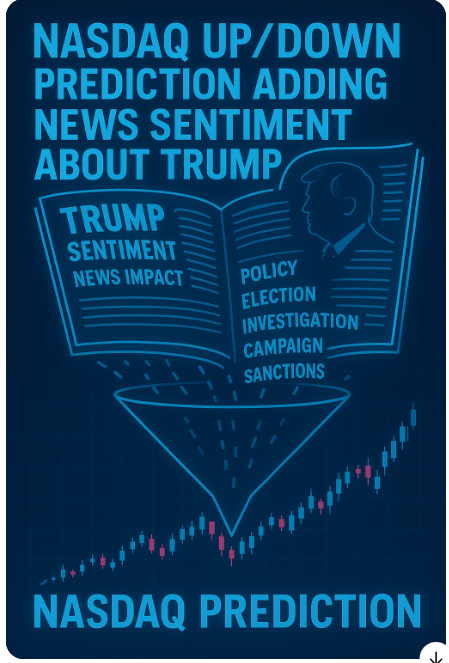

# **News Sentiment and Stock Market Prediction**

<p align="center">
  
</p>

## **Executive Summary**
This project predicts the movement of the NASDAQ index by combining **technical financial indicators** with **sentiment analysis** of Trump-related news. By leveraging modern scraping tools, data processing techniques, sentiment extraction, and machine learning (XGBoost Classifier), we build a hybrid model to enhance stock market prediction.

### **Main Goal**
Improve stock market prediction beyond traditional technical analysis by incorporating external news sentiment signals.

---

## **Logic and Components**

### **Data Extraction**
- **Financial Data**: NASDAQ Composite data from 2022 to 2025 extracted using `yfinance`.
- **News Articles**: Articles about "Trump" gathered using the GNews API for March 2025.

### **Feature Engineering**
- **Technical Indicators**: RSI, MACD, Bollinger Bands, MFI, EMA, ATR, ADX, OBV, Stochastic Oscillator.
- **Sentiment Indicators**: Daily sentiment scores shifted by 1, 2, and 3 days to create lagged sentiment features.

---

## **Model Training**
- **Target Variable**: Significant return in NASDAQ over a rolling 3-day period (greater than ±0.3%).
- **Feature Selection**: Features selected based on relevance and redundancy analysis.

### **Two Models**
1. **Full Model**: Includes 18 features.
2. **Final Improved Model**: Reduced to 7 features after redundancy analysis.

### **Evaluation**
- **Metrics**: Accuracy (Directional Accuracy - DA), Precision, Recall, ROC_AUC.
- **Threshold Adjustment**: Adjusted between 0.40-0.49 to maximize recall and directional accuracy.
- **Validation Set**: Data from 2024.
- **Real-World Prediction**: First quarter of 2025.

---

## **Key Highlights**
- **Innovative Hybrid Model**: Combines technical analysis with news sentiment.
- **Modern Scraping Tools**: Dynamic news collection without manual labeling.
- **Strong Feature Engineering**: Includes lagged features, VWAP, and volatility measures.
- **Model Tuning**: Early stopping, threshold adjustment, and class imbalance handling (using `scale_pos_weight`).
- **Real-World Performance**:
  - 60% Directional Accuracy (DA) in real 2025 predictions.
  - ROC_AUC > 62% using only public news and technical data.

---

## **Main Results**

| **Metric**        | **Final Model (Real 2025)** |
|-------------------|-----------------------------|
| **Accuracy (DA)** | 60.38%                      |
| **Precision**     | 52.78%                      |
| **Recall**        | 82.61%                      |
| **ROC_AUC**       | 62.97%                      |

- The model detects market moves with a good balance of precision and recall.
- Sentiment features proved valuable in enhancing technical predictions.

---

## **Challenges**
1. **News Availability**: Blocking.
2. **Overfitting Risk**: Solved with feature selection and parameter tuning.
3. **Low Volatility Periods**: Difficult to detect market movements during these times.


---

## **Areas of Improvement**

1. **Expand News Sources**: Broaden scraping beyond "Trump" to include broader market topics.
2. **Improve Sentiment Accuracy**: Further clean noisy news articles for better sentiment extraction.
3. **Enhance Model Robustness**: Apply ensemble models combining multiple thresholds and deploy dynamic regularization and feature selection.
4. **Backtest Strategies**: Test real investment strategies based on prediction outputs.

---

## **Installation and Setup**
1. Clone this repository:
   ```bash
   git clone https://github.com/Carlos-Sibaja/2025Topics.git
   cd 2025Topics
   ```

2. Create and activate a virtual environment:
   ```bash
   python -m venv .venv
   .venv\Scripts\activate
   ```

3. Install requirements:
   ```bash
   pip install -r requirements.txt
   ```

---

## **Main Documents and Their Use**
| **File**                      |   **Use**                                                           |
|----------------------------   |---------------------------------------------------------------------|
| `1M_nasdaq_extractor.py`      | Download NASDAQ historical data and calculate technical indicators. |
| `2M_news_scraping.py`         | Scrape news articles related to "Trump" using GNews API.            |
| `2M_scraped_news.csv`         | Saved scraped news.                                                 |
| `3M_sentiment_analysis.py`    | Perform sentiment analysis and create lagged sentiment features.    |
| `3M_nasdaq_sentiment.csv`     | NASDAQ data with added sentiment features.                          |
| `4M_Final Model.py`           | First model using all 18 variables.                                 |
| `4M_Final Model Improved.py`  | Improved model using selected features after redundancy analysis.   |


## **Technical Variables Selected and Why**
| **Feature**                | **Reason for Selection**         |
|-------------------------   |----------------------------------|
| `Close_lag2`               | Capture price omentum.           |
| `Volatility`               | Measure market  variability.     |
| `OBV`                      | Detect volume pressure.          |
| `ADX_14`                   | Capture trend strength.          |
| `VWAP_lag1`, `VWAP_lag2`   | Detect price imbalance vs. VWA   |
| `Sentiment_3DayAVG_new`    | Add news sentiment impact 3 days |

❗ Some technical indicators (like ATR, RSI, MACD) were initially included but trimmed based on redundancy analysis.

---

## **Testing Area**
- A Jupyter Notebook is included (`3M_sentiment_analysis.ipynb`) to:
  - Test sentiment feature extraction.
  - Quickly re-run models.

---

## **Authors**
- **Roberto Escalante Gafau** – ID 300383075
- **Carlos Sibaja Jiménez** – ID 300384848

---

## **Final Words**
This project is a modern, data-driven attempt to predict market behavior using both financial data and news sentiment. It demonstrates technical rigor, creativity, and attention to detail while remaining easy to understand and expand.

We faced many challenges due to our lack of experience, which made us change plans, try new things, and learn about the limits of some technologies.
